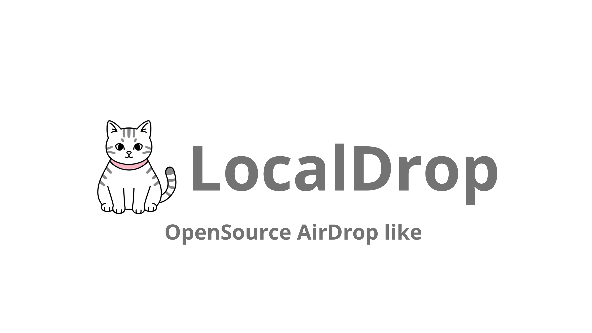

# LocalDrop

[](https://github.com/schnnjuan/LocalDrop/actions/workflows/ci.yml)
[](./LICENSE)

LocalDrop is a LAN file sharing service written in C. It combines mDNS discovery, a local web UI, short-lived local authentication, peer pairing, and an asynchronous transfer queue to move files between devices on the same network without relying on cloud infrastructure.

The project is Linux-first today and uses `libmicrohttpd`, `libcurl`, `Avahi`, and `OpenSSL`. The current web UI copy is Portuguese-first; documentation and contribution workflows are now organized for a wider open source audience.

## Status

LocalDrop is in active early-stage development.

What works today:

- Device discovery over mDNS/Avahi
- Browser-based local UI served by the binary itself
- Local admin unlock flow with session tokens
- Pairing flow with short-lived pairing codes and peer tokens
- Protected uploads to the current node
- Queued remote transfers to discovered and paired peers
- CI with hardening plus ASan, UBSan, and TSan coverage

Current limitations:

- No TLS transport yet
- No resumable transfers
- Linux-oriented dependency and discovery stack
- UI and terminal output are still focused on a single-node local workflow

## Quick Start

### Dependencies

Ubuntu/Debian:

```bash
sudo apt-get update
sudo apt-get install -y \
  build-essential \
  cmake \
  curl \
  libcurl4-openssl-dev \
  libavahi-client-dev \
  libavahi-common-dev \
  libmicrohttpd-dev \
  libqrencode-dev \
  libssl-dev \
  pkg-config
```

### Build

```bash
cmake -S . -B build -DBUILD_TESTING=ON
cmake --build build --parallel
```

### Run

```bash
./build/localdrop
```

At startup the binary:

1. Detects a local IPv4 address
2. Prints a QR code and local URL
3. Prints a 6-digit local admin code
4. Starts mDNS discovery
5. Serves the web UI on port `8080`

## User Flow

1. Start LocalDrop on the receiver.
2. Open the local web UI from the printed URL or QR code.
3. Unlock the UI with the admin code printed in the terminal.
4. Generate a pairing code on the receiver.
5. Use that pairing code from the sender to pair the peer.
6. Send a file from the sender UI to a discovered and paired peer.
7. Track transfer progress from the transfer queue panel.

Received files are committed into `downloads/`. Outgoing files are staged in `staging/` and cleaned up after completion or failure.

## Repository Guide

- [docs/README.md](./docs/README.md): documentation index
- [docs/wiki/Home.md](./docs/wiki/Home.md): project overview
- [docs/wiki/Architecture.md](./docs/wiki/Architecture.md): runtime architecture and module map
- [docs/wiki/API.md](./docs/wiki/API.md): HTTP routes, headers, and auth requirements
- [docs/wiki/Development.md](./docs/wiki/Development.md): build, test, and local development workflow
- [docs/wiki/Roadmap.md](./docs/wiki/Roadmap.md): next milestones and contribution opportunities

## Community

- [CONTRIBUTING.md](./CONTRIBUTING.md)
- [CODE_OF_CONDUCT.md](./CODE_OF_CONDUCT.md)
- [SECURITY.md](./SECURITY.md)
- [SUPPORT.md](./SUPPORT.md)

## Testing

Run the default test suite:

```bash
ctest --test-dir build --output-on-failure
```

Useful local variants:

```bash
cmake -S . -B build-asan -DBUILD_TESTING=ON -DLOCALDROP_ENABLE_HARDENING=OFF -DLOCALDROP_ENABLE_ASAN=ON
cmake --build build-asan --parallel
ctest --test-dir build-asan --output-on-failure
```

```bash
cmake -S . -B build-tsan -DBUILD_TESTING=ON -DLOCALDROP_ENABLE_HARDENING=OFF -DLOCALDROP_ENABLE_TSAN=ON
cmake --build build-tsan --parallel
ctest --test-dir build-tsan --output-on-failure -L unit
```

## License

LocalDrop is released under the [MIT License](./LICENSE).
